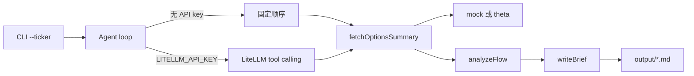

# Options Flow Research Agent

用 Node Agent 把异常期权流收成可复现的研究简报。

## 问题

异常期权流散落在终端、截图和聊天记录里。成交量、未平仓变化、扫单方向各自成立，却很难收成一份别人能复述、自己能回看的研究结论：哪几张合约异常、依据是什么、观察是哪三条。

这个仓库要做的是把「散落的期权流」变成「可复现的研究简报」，而不是再做一个行情看板。

## 架构

Week1 是一条 TypeScript 路径：CLI 收 ticker，Agent 调三个 tool，数据源默认是 MockProvider，`writeBrief` 把 Markdown 写到 `output/`。`OPTIONS_DATA_PROVIDER=theta` 才会换成 ThetaProvider，把快照映射成同一份摘要。

```text
CLI (--ticker)
  → Agent loop
      ├─ 无 LITELLM_API_KEY：固定顺序调用三个 tool（离线，不访问网络）
      └─ 有 LITELLM_API_KEY：LiteLLM 风格的 tool calling（OpenAI chat completions）
  → fetchOptionsSummary → OptionsDataProvider
      ├─ mock（默认）
      └─ theta（Theta Terminal v3 REST，凭证缺失则失败）
  → analyzeFlow
  → writeBrief → output/<TICKER>-options-brief.md
```

| 环节 | 职责 |
| --- | --- |
| CLI | 解析 `--ticker`，失败时非 0 退出 |
| Agent loop | 有密钥时走 LiteLLM tool calling；没有密钥时仍端到端调用同一批 tool |
| `OptionsDataProvider` | 期权摘要接口。`OPTIONS_DATA_PROVIDER=mock`（默认）或 `theta` |
| `MockProvider` | 返回固定样本。`TQQQ` 是手写合约；其他 ticker 用确定性伪随机样本。不访问网络 |
| `ThetaProvider` | 把 ThetaData Options Value 快照映射成 `OptionsSummary`。本地 REST 不发送密钥 |
| `fetchOptionsSummary` | 按 ticker 取摘要，并用 Zod 校验 |
| `analyzeFlow` | 标出异常合约，整理成恰好 3 条观察 |
| `writeBrief` | 写成 Markdown：标的/时间窗、异常合约表、3 条观察、免责声明 |

异常合约规则（写在 `analyzeFlow` 里，方便复述）：成交量 ≥ 1000，且 Vol/OI ≥ 2，或扫单且 Vol/OI ≥ 1.5。得分是 `Vol/OI × 扫单加权 × log10(权利金)`。默认去掉到期日等于时间窗当天的合约，因为到期日的 Vol/OI 容易偏高；`INCLUDE_0DTE=1` 或 `pnpm brief --ticker TQQQ --include-0dte` 可以把它们算进去。看涨、看跌各取得分最高的 3 张。观察里的权利金分成用全部入选异常，而不只是表里这几行；Theta 简报还会写上全场看涨/看跌的成交量与权利金。

Mock 的截止时间冻在 `2026-10-06T20:05:00.000Z`，时间窗是 `2026-10-06 09:30–16:00 ET`。同一 ticker、同一次实现，离线路径应得到同一份简报。



数据从 tool 进来，结论从 `writeBrief` 出去。模型不直接口述一份研报就结束。Week1 不实现 Web UI、发帖、Code Mode。真实行情走 ThetaProvider，默认路径仍是 Mock。

## 用 Mock 运行

需要 Node.js >= 20 和 [pnpm](https://pnpm.io/)。不需要 API key，也不需要网络。

```bash
pnpm install
pnpm brief --ticker TQQQ
```

成功时会打印模式和路径，例如：

```text
模式：离线 Mock（未设置 LITELLM_API_KEY）
已写入 output/TQQQ-options-brief.md
```

`output/*.md` 不入库。想改走模型循环时，复制环境变量样例并填上自己的网关，不要把密钥提交进仓库：

```bash
cp .env.example .env
# 编辑 LITELLM_API_KEY、LITELLM_BASE_URL、LITELLM_MODEL
```

即使配了 LiteLLM，默认的合约数据仍然来自 MockProvider。`LITELLM_API_KEY` 只决定谁来选择下一步 tool。

## ThetaData Options Value

选定的实盘源是 ThetaData Options Value。当前 HTTP 文档把 v3 REST 放在本机 [Theta Terminal](https://docs.thetadata.us/Articles/Getting-Started/Getting-Started.html)，不是一个公开的云端地址。Python 客户端可以直连 MDDS，这条 Node 路径不使用它。

| 场景 | 基址 |
| --- | --- |
| 本机 Terminal（默认） | `http://127.0.0.1:25503/v3` |
| 本机 staging Terminal | `http://127.0.0.1:25504/v3` |

`OPTIONS_DATA_PROVIDER=theta` 时，`fetchOptionsSummary` 会请求 Options Value 档位的三条期权快照，再映射成和 Mock 相同的 `OptionsSummary`。标的价不走 Theta 的股票快照：实测账号是 Options VALUE、Stock FREE，`/stock/snapshot/ohlc`（以及股票 quote、股票 history ohlc）会返回 403。

| 用途 | 路径 |
| --- | --- |
| 成交量、OHLC | `GET /option/snapshot/ohlc?symbol=TQQQ&expiration=*&format=json` |
| 买卖价 | `GET /option/snapshot/quote` |
| 未平仓 | `GET /option/snapshot/open_interest` |
| 标的价（默认） | Yahoo `GET /v8/finance/chart/{ticker}?interval=1m&range=1d`，先 `query1.finance.yahoo.com`，再 `query2`。读 `regularMarketPrice` 与 `regularMarketTime`。不需要密钥 |
| 标的价（回退） | `GET /stock/history/eod?symbol=TQQQ&start_date=YYYYMMDD&end_date=YYYYMMDD&format=json`。FREE 档可用，取最后一根日线的 `close`。行里没有 `symbol` 或 `timestamp`，用 `last_trade` 标日期 |

`UNDERLYING_PRICE_SOURCE=yahoo`（默认，或留空）先问 Yahoo，失败再用 EOD。设成 `theta-eod` 则只读免费日线。两边都失败时进程以非 0 退出，说明原因，不会改回 Mock。简报标的价一行会写明来源、日期和时段，例如 `标的价格：83.62（Yahoo 常规交易收盘 2026-10-07 16:00 ET）` 或盘中的 `Yahoo 盘中延迟 2026-10-07 15:00 ET`。日线回退是 `标的价格：84.25（Theta 日线收盘 2026-10-06）`。Mock 简报不带这个括号。Theta 简报另注：未平仓是当日起始值（前一交易日收盘后），不是盘中更新。

OHLC 快照给的是每张合约最后一根成交 K 线，日期可以早于最新交易日。映射只保留时间戳所在美东日期等于这批数据里最新交易日的行，更早的成交量不计入当日。

权利金估算（只用于 Theta；Mock 仍是成交量 × 买卖中价 × 100）：有正的 OHLC `vwap` 就用它，否则用正的 `(open + high + low + close) / 4`，再否则用 `close`，最后才用买卖中价。Value 档的收盘买卖价经常不能代表当日成交。

JSON 形状是文档里的 `{ response: [{ contract, data }] }`。合约按到期日、行权价和方向拼到一起。Value 档没有 trade，所以方向是「不明」、扫单是「否」，异常规则仍只看成交量和 Vol/OI。隐含波动率和 delta 属于 Standard 及以上，这里填 0，简报启发式不用它们。期权快照按两批发出，避开 Value 档同时 2 个并发的限制。`trade` 与 greeks 端点不调用，付费的 `/stock/snapshot/ohlc` 也不调用。

认证发生在 Terminal 启动时，不在每一条本地 GET 上。本进程不要求 `THETADATA_API_KEY` 或邮箱/密码，也不会把它们放进请求。密钥只留给 Terminal 自己：

- `THETADATA_API_KEY`：门户里的 API key（Terminal 20260615+）
- `THETADATA_USERNAME` 与 `THETADATA_PASSWORD`：账号邮箱和密码。Terminal 自己的文档用 `creds.txt`；本仓库不生成这个文件

```bash
cp .env.example .env
# 编辑 OPTIONS_DATA_PROVIDER=theta
# 密钥写进 Terminal 的环境或 creds.txt，不要写进这个仓库
java -jar ThetaTerminalv3.jar
pnpm brief --ticker TQQQ
```

Terminal 连不上，或 JSON 对不上上述形状时，进程以非 0 退出并说明原因。它不会悄悄改回 Mock。把 `OPTIONS_DATA_PROVIDER` 留空或设回 `mock`，离线简报仍然可用。

不启动 Terminal 也能检查映射。`src/providers/fixtures/theta-value.ts` 是按文档形状记下来的样本；`src/providers/fixtures/live/` 是一次实盘响应的小样本（含股票快照 403 正文和免费 EOD）。测试里的 Yahoo 响应用假的 `fetch`，不访问网络：

```bash
pnpm test
pnpm typecheck
pnpm brief --ticker TQQQ
```

`pnpm test` 不访问网络。最后一条命令仍走 Mock。本机 Terminal 已登录后再跑：

```bash
OPTIONS_DATA_PROVIDER=theta pnpm brief --ticker TQQQ
```

## 目录结构

```text
.
├── src/
│   ├── cli.ts                          # 解析 --ticker 并跑 pipeline
│   ├── agent/loop.ts                   # LiteLLM tool calling；无 key 时离线回退
│   ├── env.ts                          # 读取 .env，不覆盖已有环境变量
│   ├── providers/
│   │   ├── types.ts                    # OptionsDataProvider 与 Zod 形状
│   │   ├── mock.ts                     # MockProvider
│   │   ├── theta.ts                    # ThetaProvider：Value 快照映射成摘要
│   │   ├── theta-map.ts                # 纯映射，fixture 测试不连 Terminal
│   │   ├── fixtures/theta-value.ts     # 记录的 Theta JSON 形状
│   │   ├── fixtures/live/              # 实盘小样本：期权快照、403、免费 EOD
│   │   └── index.ts                    # mock | theta 工厂
│   ├── underlying/price.ts             # Yahoo 图表，失败再用 Theta 免费日线
│   └── tools/                          # fetchOptionsSummary / analyzeFlow / writeBrief
├── output/                             # 生成的 Markdown（*.md 不入库）
├── .env.example                        # 数据源与可选密钥的名字，值为空
├── package.json
├── tsconfig.json
├── LICENSE
└── README.md
```

## Roadmap

1. **Week1 MVP** — TypeScript、MockProvider、三个 tool、离线 Agent 路径，输出含异常合约表和 3 条观察的 Markdown。当前仓库就是这一步。
2. **ThetaData** — Options Value 的期权快照已经映射成同一份 `OptionsSummary`。标的价默认来自 Yahoo，失败再用免费日线。默认数据源仍是 Mock。扫单和希腊值不在该档。密钥留在 Terminal，不由本进程发送。
3. **Code Mode** — 在固定 tool 之外提供受控的临时代码执行。Week1 不做。
4. **Demo 录屏** — 录下从输入 ticker 到落盘简报的一次完整运行。

## 免责声明

本项目产出的是研究简报草稿，用于学习 agent 工作流和公开构建。内容不是投资建议，不构成对任何证券的买卖推荐。期权有归零风险，请自行核实数据并独立决策。

## License

[MIT](./LICENSE) © 2026 Quill Lu
