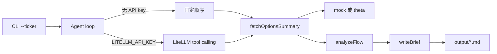

# Options Flow Research Agent

用 Node Agent 把异常期权流收成可复现的研究简报。

## 问题

异常期权流散落在终端、截图和聊天记录里。成交量、未平仓变化、扫单方向各自成立，却很难收成一份别人能复述、自己能回看的研究结论：哪几张合约异常、依据是什么、观察是哪三条。

这个仓库要做的是把「散落的期权流」变成「可复现的研究简报」，而不是再做一个行情看板。

## 架构

Week1 是一条 TypeScript 路径：CLI 收 ticker，Agent 调三个 tool，数据源默认是 MockProvider，`writeBrief` 把 Markdown 写到 `output/`。`OPTIONS_DATA_PROVIDER=theta` 才会换成 ThetaProvider 骨架。

```text
CLI (--ticker)
  → Agent loop
      ├─ 无 LITELLM_API_KEY：固定顺序调用三个 tool（离线，不访问网络）
      └─ 有 LITELLM_API_KEY：LiteLLM 风格的 tool calling（OpenAI chat completions）
  → fetchOptionsSummary → OptionsDataProvider
      ├─ mock（默认）
      └─ theta（Theta Terminal v3 REST，凭证缺失则失败）
  → analyzeFlow
  → writeBrief → output/<TICKER>-options-brief.md
```

| 环节 | 职责 |
| --- | --- |
| CLI | 解析 `--ticker`，失败时非 0 退出 |
| Agent loop | 有密钥时走 LiteLLM tool calling；没有密钥时仍端到端调用同一批 tool |
| `OptionsDataProvider` | 期权摘要接口。`OPTIONS_DATA_PROVIDER=mock`（默认）或 `theta` |
| `MockProvider` | 返回固定样本。`TQQQ` 是手写合约；其他 ticker 用确定性伪随机样本。不访问网络 |
| `ThetaProvider` | ThetaData Options Value 的骨架。请求本机 Theta Terminal v3；凭证只来自环境变量 |
| `fetchOptionsSummary` | 按 ticker 取摘要，并用 Zod 校验 |
| `analyzeFlow` | 标出异常合约，整理成恰好 3 条观察 |
| `writeBrief` | 写成 Markdown：标的/时间窗、异常合约表、3 条观察、免责声明 |

异常合约规则（写在 `analyzeFlow` 里，方便复述）：成交量 ≥ 1000，且 Vol/OI ≥ 2，或扫单且 Vol/OI ≥ 1.5。按 `Vol/OI × 扫单加权 × log10(权利金)` 取前 5。

Mock 的截止时间冻在 `2026-10-06T20:05:00.000Z`，时间窗是 `2026-10-06 09:30–16:00 ET`。同一 ticker、同一次实现，离线路径应得到同一份简报。



数据从 tool 进来，结论从 `writeBrief` 出去。模型不直接口述一份研报就结束。Week1 不实现 Web UI、发帖、Code Mode。真实行情只留了 ThetaProvider 骨架，默认路径仍是 Mock。

## 用 Mock 运行

需要 Node.js >= 20 和 [pnpm](https://pnpm.io/)。不需要 API key，也不需要网络。

```bash
pnpm install
pnpm brief --ticker TQQQ
```

成功时会打印模式和路径，例如：

```text
模式：离线 Mock（未设置 LITELLM_API_KEY）
已写入 output/TQQQ-options-brief.md
```

`output/*.md` 不入库。想改走模型循环时，复制环境变量样例并填上自己的网关，不要把密钥提交进仓库：

```bash
cp .env.example .env
# 编辑 LITELLM_API_KEY、LITELLM_BASE_URL、LITELLM_MODEL
```

即使配了 LiteLLM，默认的合约数据仍然来自 MockProvider。`LITELLM_API_KEY` 只决定谁来选择下一步 tool。

## ThetaData Options Value

选定的实盘源是 ThetaData Options Value。当前 HTTP 文档把 v3 REST 放在本机 [Theta Terminal](https://docs.thetadata.us/Articles/Getting-Started/Getting-Started.html)，不是一个公开的云端地址。Python 客户端可以直连 MDDS，那条路不在这个 Node 骨架里。

| 场景 | 基址 |
| --- | --- |
| 本机 Terminal（默认） | `http://127.0.0.1:25503/v3` |
| 本机 staging Terminal | `http://127.0.0.1:25504/v3` |

官方请求形如 `GET {THETADATA_BASE_URL}/option/snapshot/ohlc?symbol=TQQQ&expiration=*&format=json`。Options Value 档位这一版会用到的快照是 `ohlc`、`quote`、`open_interest`。`trade` 快照属于更高的 Standard 档，骨架不调用。

认证发生在 Terminal 启动时，不在每一条本地 GET 上。两种官方方式，都只放在 `.env`，不要写进仓库：

- `THETADATA_API_KEY`：门户里的 API key（Terminal 20260615+）
- `THETADATA_USERNAME` 与 `THETADATA_PASSWORD`：账号邮箱和密码。Terminal 自己的文档用 `creds.txt`；本仓库不生成这个文件

```bash
cp .env.example .env
# 编辑 OPTIONS_DATA_PROVIDER=theta，并填上 THETADATA_API_KEY
# 或同时填上 THETADATA_USERNAME 与 THETADATA_PASSWORD
java -jar ThetaTerminalv3.jar
pnpm brief --ticker TQQQ
```

没配凭证就选 `theta` 时，进程会说明要设置哪些变量，然后以非 0 退出。它不会悄悄改回 Mock。把 `OPTIONS_DATA_PROVIDER` 留空或设回 `mock`，Week1 的离线简报仍然可用。

ThetaProvider 现在会按上面的 URL 请求 Terminal。响应还不会映射成简报；映射完成之前，请继续用 mock 路径产出 `output/*.md`。

## 目录结构

```text
.
├── src/
│   ├── cli.ts                          # 解析 --ticker 并跑 pipeline
│   ├── agent/loop.ts                   # LiteLLM tool calling；无 key 时离线回退
│   ├── env.ts                          # 读取 .env，不覆盖已有环境变量
│   ├── providers/
│   │   ├── types.ts                    # OptionsDataProvider 与 Zod 形状
│   │   ├── mock.ts                     # MockProvider
│   │   ├── theta.ts                    # ThetaProvider 骨架
│   │   └── index.ts                    # mock | theta 工厂
│   └── tools/                          # fetchOptionsSummary / analyzeFlow / writeBrief
├── output/                             # 生成的 Markdown（*.md 不入库）
├── .env.example                        # 数据源与可选密钥的名字，值为空
├── package.json
├── tsconfig.json
├── LICENSE
└── README.md
```

## Roadmap

1. **Week1 MVP** — TypeScript、MockProvider、三个 tool、离线 Agent 路径，输出含异常合约表和 3 条观察的 Markdown。当前仓库就是这一步。
2. **ThetaData** — Options Value 的 ThetaProvider 骨架已经接上，默认仍是 Mock。下一步是把 snapshot 映射成 `OptionsSummary`。密钥只放环境变量。
3. **Code Mode** — 在固定 tool 之外提供受控的临时代码执行。Week1 不做。
4. **Demo 录屏** — 录下从输入 ticker 到落盘简报的一次完整运行。

## 免责声明

本项目产出的是研究简报草稿，用于学习 agent 工作流和公开构建。内容不是投资建议，不构成对任何证券的买卖推荐。期权有归零风险，请自行核实数据并独立决策。

## License

[MIT](./LICENSE) © 2026 Quill Lu
