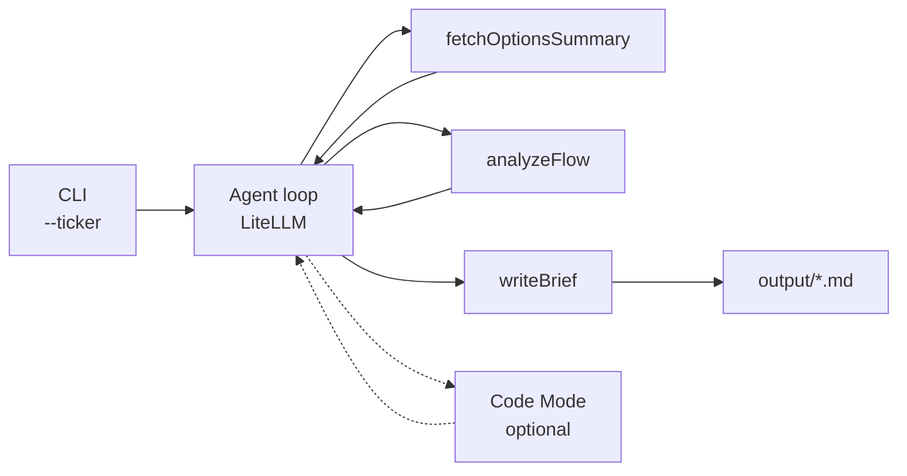

# Options Flow Research Agent

用 Node Agent 把异常期权流收成可复现的研究简报。

## 问题

异常期权流散落在终端、截图和聊天记录里。成交量、未平仓变化、扫单方向各自成立，却很难收成一份别人能复述、自己能回看的研究结论：哪几张合约异常、依据是什么、观察是哪三条。

这个仓库要做的是把「散落的期权流」变成「可复现的研究简报」，而不是再做一个行情看板。

## 目标 / 第一周 MVP

Week1 只打通一条路径：

1. CLI 输入 ticker（例如 `TQQQ`）
2. 拉取该标的的期权摘要
3. 输出一份 Markdown 简报：一张异常合约表，加 3 条观察

简报写入 `output/`。同一 ticker、同一份输入，在 mock 数据下应得到同一份简报，方便对照和复述。

## Agent 架构

```text
CLI → Agent loop (LiteLLM) → Tools (fetchOptionsSummary / analyzeFlow / writeBrief) → 可选 Code Mode → 落盘 md
```

| 环节 | 职责 |
| --- | --- |
| CLI | 解析 `--ticker`，启动一次研究任务 |
| Agent loop | 通过 LiteLLM 调用模型，决定下一步用哪个 tool |
| `fetchOptionsSummary` | 按 ticker 取期权摘要。Week1 用 mock；真实数据源之后再接 |
| `analyzeFlow` | 从摘要里标出异常合约，整理成可引用的观察 |
| `writeBrief` | 写成 Markdown（异常合约表 + 3 条观察）并写入 `output/` |
| Code Mode（可选） | 固定 tool 不够用时，让模型写一小段临时代码做计算，再把结果交回 loop。Week1 不实现 |
| 落盘 | 简报是文件，方便 diff、复述和录屏 |



数据从 tool 进来，结论从 `writeBrief` 出去。模型不直接「口述一份研报」就结束；每一步都对应一个可替换的 tool。

## 目录结构

```text
.
├── src/
│   ├── cli.js            # CLI 入口。当前为占位，打印用法后退出
│   ├── agent/            # Agent loop（LiteLLM）。Week1 再填
│   └── tools/            # fetchOptionsSummary / analyzeFlow / writeBrief
├── output/               # 生成的 Markdown 简报（*.md 不入库）
├── package.json
├── LICENSE
└── README.md
```

## 快速开始

需要 Node.js >= 20，以及 [pnpm](https://pnpm.io/)。

```bash
pnpm install
pnpm brief --ticker TQQQ
```

Week1 尚未接入真实数据源。在接上之前，摘要与分析走 mock，用来先打通「ticker → Markdown 简报」。当前 `src/cli.js` 只打印用法并退出，不请求任何行情接口，仓库里也没有写死的数据源地址或密钥。

## Roadmap

1. **Week1 MVP** — CLI、Agent loop、三个 tool 的 mock 实现，输出含异常合约表和 3 条观察的 Markdown 简报。
2. **真实数据源** — 用可配置的数据源替换 mock。密钥只放环境变量，不提交到仓库。
3. **Code Mode** — 在 tool 之外提供受控的临时代码执行，处理一次性计算。
4. **Demo 录屏** — 录下从输入 ticker 到落盘简报的一次完整运行。

## 免责声明

本项目产出的是研究简报草稿，用于学习 agent 工作流和公开构建。内容不是投资建议，不构成对任何证券的买卖推荐。期权有归零风险，请自行核实数据并独立决策。

## License

[MIT](./LICENSE) © 2026 Quill Lu
